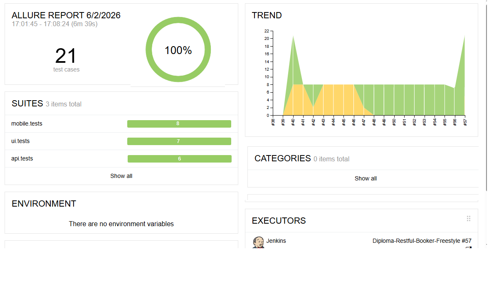
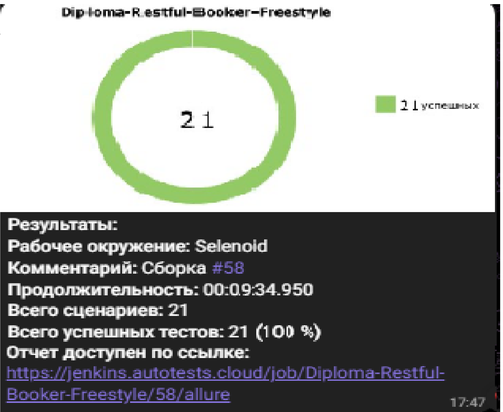
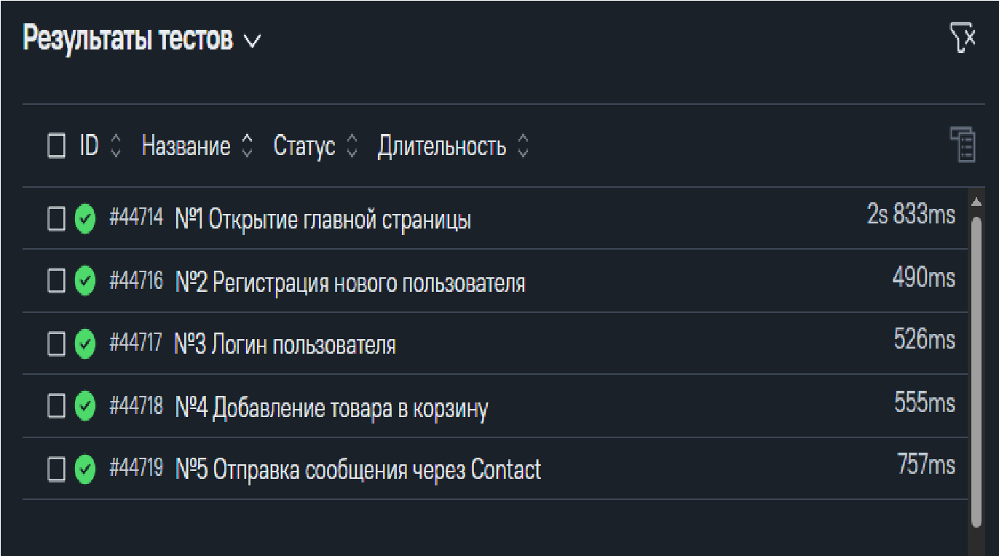

<div align="center">
  
  
  
  
  
  
  
  
</div>

# 🎓 Дипломный проект: Автоматизация тестирования UI/API/Mobile

## 📋 О проекте

Дипломный проект по автоматизации тестирования интернет-магазина [Demoblaze](https://demoblaze.com) и мобильного приложения [Wikipedia](https://wikipedia.org).

**Ключевая особенность:** объединение трех уровней тестирования в одном репозитории:

| Уровень | Количество тестов | Описание |
|:---|:---:|:---|
| **🌐 UI тесты** | 8 | Веб-интерфейс Demoblaze (Selene + Selenoid) |
| **⚙️ API тесты** | 6 | Бэкенд Demoblaze с валидацией JSON Schema |
| **📱 Mobile тесты** | 7 | Android приложение Wikipedia (Appium + BrowserStack) |

📊 **Итог: 21 тест — 100% успешных!**

---

## 🚀 Технологии и инструменты

| Категория | Технологии |
|:---|:---|
| **Язык** | Python 3.12 |
| **Тестирование** | Pytest + Selene |
| **Mobile** | Appium + BrowserStack |
| **API** | Requests + JSON Schema |
| **Отчетность** | Allure + Allure TestOps |
| **CI/CD** | Jenkins |
| **Качество кода** | Ruff |

---

## 📁 Структура проекта

```text
diploma_restful_booker/
├── api/                    # API тесты
│   ├── client.py           # HTTP-клиент
│   ├── schemas/            # JSON Schema
│   ├── models.py           # Pydantic модели
│   └── tests/              # 6 тестов
├── ui/                     # UI тесты
│   ├── pages/              # PageObject
│   ├── conftest.py         # Selenoid
│   └── tests/              # 8 тестов
├── mobile/                 # Mobile тесты
│   ├── pages/              # PageObject
│   ├── conftest.py         # BrowserStack
│   └── tests/              # 7 тестов
├── utils/                  # Утилиты
├── config.py
├── conftest.py
├── pyproject.toml
├── pytest.ini
└── requirements.txt
```
---

## 🧪 Тест-кейсы

### 🔹 UI тесты (Demoblaze.com)

| № | Название | Описание |
|:-:|:---|:---|
| 1 | Открытие главной страницы | Проверка загрузки витрины |
| 2 | Регистрация пользователя | Создание нового аккаунта |
| 3 | Выбор категории товаров | Фильтрация по категориям |
| 4 | Просмотр карточки товара | Детальная информация |
| 5 | Логин пользователя | Авторизация |
| 6 | Добавление в корзину | Добавление товара |
| 7 | Отправка сообщения Contact | Форма обратной связи |
| 8 | Переключение категорий | Динамическое обновление |

### 🔹 API тесты (Demoblaze API)

| № | Метод | Эндпоинт | Описание |
|:-:|:-:|:---|:---|
| 1 | POST | `/signup` | Регистрация нового пользователя |
| 2 | POST | `/signup` | Регистрация существующего |
| 3 | POST | `/bycat` | Товары категории Phones |
| 4 | POST | `/bycat` | Товары категории Laptops |
| 5 | POST | `/login` | Неверный пароль |
| 6 | POST | `/login` | Несуществующий пользователь |

### 🔹 Mobile тесты (Wikipedia Android)

| № | Название | Описание |
|:-:|:---|:---|
| 1 | Complete onboarding flow | Прохождение 4 экранов онбординга |
| 2 | Skip onboarding | Пропуск экранов |
| 3 | Verify onboarding text | Проверка текстов |
| 4 | Search and open article | Поиск и открытие статьи |
| 5 | Open specific article | Поиск конкретной статьи |
| 6 | Navigate back | Возврат к результатам |
| 7 | Search BrowserStack | Поиск "BrowserStack" |

## 📊 Allure отчеты

### Jenkins + Allure Report



**Результаты:**

✅ **Всего тестов: 21**

✅ **Успешных: 21 (100%)**

📦 api.tests: 6 тестов

📦 ui.tests: 8 тестов

📦 mobile.tests: 7 тестов

### Telegram уведомление



## 🎬 Видео отчеты

### 📱 Mobile Test (BrowserStack)

https://github.com/user-attachments/assets/ebc0f1c8-5dfd-4677-b9ac-a61f48457f14

### ✉️ Contact Message Test

https://github.com/user-attachments/assets/731594ee-fd9b-4aba-b504-6d233db12be0

> 📝 Отправляется сообщение: *"Привет! Меня зовут Дмитрий. Ищу работу AQA Python разработчиком."*

## 📈 Allure TestOps (Ручные тесты)

| ID | Название | Статус | Длительность |
|:---|:---|:---:|:---|
| #44714 | Открытие главной страницы | ✅ PASSED | 2s 833ms |
| #44716 | Регистрация нового пользователя | ✅ PASSED | 490ms |
| #44717 | Логин пользователя | ✅ PASSED | 526ms |
| #44718 | Добавление товара в корзину | ✅ PASSED | 555ms |
| #44719 | Отправка сообщения через Contact | ✅ PASSED | 757ms |




## 🛠 Запуск тестов

### Локальный запуск

```bash
# Установка зависимостей
pip install -r requirements.txt

# API тесты
pytest api/tests/ -v

# UI тесты
pytest ui/tests/ -v

# Все тесты
pytest api/tests/ ui/tests/ -v
```

### Mobile тесты (BrowserStack)

**Windows PowerShell:**
```powershell
\$env:CONTEXT="bstack"
pytest mobile/tests/ -v
```

**Linux / macOS:**
```bash
export CONTEXT=bstack
pytest mobile/tests/ -v
```

### Генерация Allure отчета
```bash
pytest --alluredir=allure-results
allure serve allure-results
```

### Jenkins
Проект настроен в Jenkins с параметризованной сборкой:
* Выбор контекста (`bstack` / `local_emulator`)
* Автоматическая публикация Allure отчета
* Уведомления в Telegram

---

## ✅ Выполнение критериев диплома


| Критерий | Статус | Детали |
|:---|:---:|:---|
| **5+ API тестов** | ✅ | 6 тестов с JSON Schema валидацией |
| **7+ UI тестов** | ✅ | 8 тестов с PageObject (Fluent style) |
| **3+ Mobile тестов** | ✅ | 7 тестов на BrowserStack |
| **PageObject** | ✅ | Реализован для UI и Mobile |
| **Модели (Pydantic/JSON Schema)** | ✅ | Pydantic модели для API, JSON Schema |
| **Allure отчетность** | ✅ | Скриншоты, видео, логи, TestOps |
| **Allure TestOps (ручные тесты)** | ✅ | Добавлено 5 ручных тест-кейсов |
| **Jenkins CI/CD** | ✅ | Параметризованная сборка |
| **Telegram уведомления** | ✅ | Автоматические оповещения |
| **GitHub профиль** | ✅ | README с бейджами и видео |
| **Ruff линтинг** | ✅ | Код проверен и отформатирован |

---

## 👤 Автор

**Дмитрий Иванцов**

[](https://github.com)
[](https://t.me)
[](https://linkedin.com)

* **Платформа:** QA.GURU

---

## 📄 Лицензия

Данный проект создан исключительно в учебных и образовательных целях. Распространяется под лицензией [MIT](LICENSE).

<div align="center"> <sub>Built with ❤️ for QA.GURU Diploma</sub> </div>
